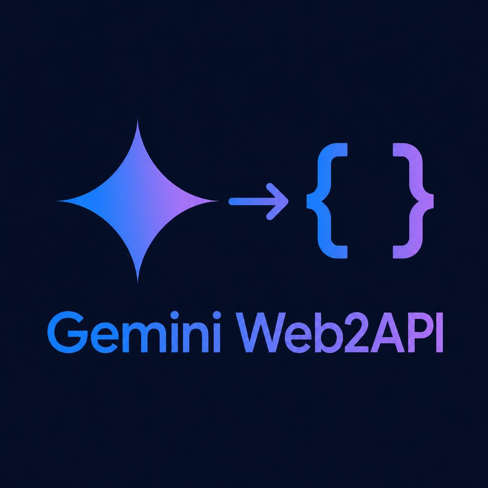

<p align="center">
  
</p>

# gemini-web2api

Google Gemini ke **web app** ke internal (reverse-engineered) `StreamGenerate` endpoint ko
call karke ek **OpenAI-compatible free API server** banata hai — bina official API key,
bina payment. Koi bhi OpenAI client (Cherry Studio, ChatBox, Codex CLI, Gemini CLI,
`openai-python` SDK) isse baat kar sakta hai jaise ye OpenAI/Google ka API ho.

> **Live-verified (Oct 2026):** anonymous (bina cookie) `gemini-3.6-flash` generation,
> SSE streaming aur `/v1beta` Google-native endpoint sab tested aur working hain.
> Build label ka naya format (`cfb2h` → `boq_gemini-web-uiserver_*`) bhi handle hota hai.

## Quick start

```bash
pip install -r requirements.txt   # httpx + curl_cffi + gemini-webapi
python -m gemini_web2api          # http://localhost:8000 par start
```

```bash
curl http://localhost:8000/v1/chat/completions \
  -H "Content-Type: application/json" \
  -d '{"model":"gemini-3.6-flash","messages":[{"role":"user","content":"Hello!"}]}'
```

Kisi bhi OpenAI client me:

| Setting | Value |
|---|---|
| Base URL | `http://localhost:8000/v1` |
| API key | kuch bhi (jab tak `api_keys` config me empty hai) |
| Model | `gemini-3.6-flash` (ya niche wali table se koi bhi) |

## File map

```
web2api/
├── gemini_web2api/            # modular package
│   ├── __main__.py            #   CLI entry: python -m gemini_web2api
│   ├── config.py              #   config.json load + defaults + cookie file parsing
│   ├── models.py              #   model definitions + @think=N parsing
│   ├── gemini.py              #   ★ CORE: StreamGenerate protocol (payload/URL/headers/parse)
│   ├── tools.py               #   messages→prompt conversion + tool_call parsing
│   ├── multimodal.py          #   image upload (Scotty resumable upload)
│   └── server.py              #   HTTP endpoints (OpenAI + Google native formats)
├── tests/test_modular_sync.py # 72 unit tests (sab mocked — bina network chalte hain)
├── config.example.json        # config template
├── Dockerfile + docker-compose.yml
└── SETUP.md                   # step-by-step setup guide
```

## API Surface

| Endpoint | Format | Kisake liye |
|---|---|---|
| `GET /` | health JSON | status check |
| `GET /v1/models` | OpenAI | model list |
| `POST /v1/chat/completions` | OpenAI | main chat (stream + non-stream + tools + images) |
| `POST /v1/responses` | OpenAI Responses | Codex CLI (full SSE event sequence) |
| `GET /v1beta/models` | Google native | Gemini CLI model list |
| `POST /v1beta/models/{model}:generateContent` | Google native | non-streaming |
| `POST /v1beta/models/{model}:streamGenerateContent` | Google native | streaming (`?alt=sse` → SSE, warna newline-delimited JSON) |

**API key auth** (optional, `api_keys` config): `Authorization: Bearer <key>`,
`x-api-key:`, `x-goog-api-key:`, ya `?key=` — chaarõ chalte hain. Empty list = no auth.

**Server:** bounded worker-pool `HTTPServer` (64 daemon threads, fixed footprint —
spike par bhi thread explosion nahi). Chunked transfer-encoding request bodies bhi
manually parse hoti hain. CORS headers enabled.

## Reasoning control (off / low / medium / high / max)

Teen tarike se reasoning depth control karo — dono same upstream `think` field
(0 = deepest … 4 = shallowest/off) par map hote hain:

**1. OpenAI-style `reasoning_effort` param** (chat completions + responses):

```bash
curl http://localhost:8000/v1/chat/completions \
  -H "Content-Type: application/json" \
  -d '{"model":"gemini-3.6-flash","reasoning_effort":"off",
       "messages":[{"role":"user","content":"Hello!"}]}'
```

| `reasoning_effort` | think depth | MATLAB |
|---|---|---|
| `off` / `minimal` / `none` | 4 | sabse fast — thinking skip, seedha jawab |
| `low` | 3 | halki soch |
| `medium` / `med` | 2 | balanced |
| `high` | 1 | gehri soch |
| `max` / `ultra` | 0 | deepest thinking (sabse slow, sabse smart) |

**2. `@think=` model suffix** (ab words bhi chalte hain):
`gemini-3.6-flash@think=off`, `@think=low`, `@think=high`, `@think=max`, ya purane
digits `@think=0..4`.

**3. Google-native `thinkingConfig`**: `generationConfig.thinkingConfig.thinkingBudget`
— `0` = off, `-1` = dynamic(≈medium), positive budget buckets (≤4096 low … >24576 max).

> Latency ka sach: `off` par bhi upstream Gemini ko jawab generate karne me
> ~1-3s lagte hain — ye Google ka time hai, kam nahi ho sakta. Server khud
> har request par sirf ~1-20ms add karta hai (live-measured).

## Models

| Model name | mode | think | Note |
|---|---|---|---|
| `gemini-3.7-flash` / `gemini-3.6-flash` / `gemini-3.5-flash` | 1 | 4 | Flash (teenõ same backend) |
| `gemini-3.5-flash-thinking` | 2 | 0 | Sabse lamba output |
| `gemini-3.1-pro` | 3 | 4 | Pro routing ke liye Gemini Advanced cookie chahiye, warna silently Flash |
| `gemini-auto` | 4 | 4 | auto-select |
| `gemini-3.5-flash-thinking-lite` | 5 | 0 | adaptive thinking |
| `gemini-flash-lite` | 6 | 4 | sabse fast |
| `gemini-3.1-pro-enhanced` | 3 | 4 | extra payload flags `{31:2, 80:3}` |

`@think=N` suffix: `gemini-3.5-flash-thinking@think=2` likho → thinking depth override
(0 = deepest … 4 = shallowest). Unknown model silently `gemini-3.6-flash` par fall back.

## Features

- **Streaming** — Gemini har event me full text bhejta hai; server `delta = new[len(prev):]`
  karke sirf naya hissa SSE me bhejta hai. Mid-stream rewrite par auto-retry.
- **Thinking trace (`reasoning_content`)** — Gemini jawab se pehle ~2-6s "sochta" hai
  (ye upstream latency hai, kam nahi ho sakti). Server us thinking trace ko
  OpenAI-style `reasoning_content` deltas me stream karta hai (DeepSeek jaisa) —
  ChatBox / NextChat / LobeChat isse "thinking" pane me dikhati hain, isliye wait
  me bhi activity dikhti hai. Non-streaming me `message.reasoning_content` field.
  Thinking text upstream candidate ke index `[37]` me rehti hai; absent hone par
  field nahi bhejta (purane shapes safe).
- **Multi-turn** — har request single-turn hoti hai; poori history ek flat prompt me
  simulate hoti hai (`[System instruction]:`, `[Assistant]:`, `[Tool result for X]:` markers).
- **Tool calling** — OpenAI `tools[]` prompt me inject hote hain; model ``` ```tool_call ```
  blocks likhta hai jo parse hoke `tool_calls[]` + `finish_reason: "tool_calls"` bante hain.
  Tools hõ to streaming single-chunk me aata hai (full response chahiye parse ke liye).
- **Vision (live-verified ✅)** — `image_url` / data-URL / base64 / `inlineData` formats.
  Google file-attached requests par strict bot-detection lagata hai, isliye images
  `gemini-webapi` library engine se jaati hain (browser-session dance + Chrome TLS).
  **Cookie zaroori hai** (`__Secure-1PSID` cookie.txt me). Health me `"images": "ready"` dikhega.
- **Health status** — `GET /` par `cookie` (not set / file empty / loaded) aur
  `images` (ready / engine missing / needs __Secure-1PSID cookie) fields.
- **Auth levels** — Anonymous (Flash models chalte hain) → Cookie file (`cookie.txt` text ya
  JSON `{cookie, sapisid}`, mtime-cached — file badlo to restart nahi chahiye) →
  cookie + auto `SAPISIDHASH` + auto `SNlM0e` xsrf token.
- **Auto-recovery** — build label (`cfb2h`) page se auto-extract; 405 par BL refresh +
  retry, 400 par xsrf refresh + retry, 429 par `Retry-After` respect, exponential backoff.
- **Config hot-reload** — cookie file ka mtime cache; restart ke bina cookie swap.

## Config (`config.json`)

```json
{
  "port": 8000, "host": "0.0.0.0",
  "retry_attempts": 3, "retry_delay_sec": 2, "request_timeout_sec": 180,
  "auth_user": null,          // /u/N/ account index (multi-account Google)
  "xsrf_token": null,         // auto-fetch hota hai cookie hone par
  "default_model": "gemini-3.6-flash",
  "api_keys": [],             // ["sk-gemini"] = auth on
  "cookie_file": null,        // "cookie.txt"
  "proxy": null,              // "http://127.0.0.1:7890" (Clash/V2Ray)
  "log_requests": true,
  "temporary_chats": false,   // true = history account me save nahi hogi
  "state_refresh_sec": 300,   // background BL+xsrf refresh (0 = off)
  "max_concurrent_requests": 8, // upstream parallel Gemini calls ki limit
  "queue_wait_sec": 30,       // busy hone par max itna wait, phir 429 (0 = infinite)
  "pool_workers": 64          // HTTP worker threads (high traffic me badha sakte ho)
}
```

CLI: `--port`, `--host`, `--config`, `--cookie-file`, `--proxy`.
Config search order: `--config` → `GEMINI_WEB2API_CONFIG` env → `./config.json` →
`~/.config/gemini-web2api/config.json`.

## Tests

```bash
python -m unittest discover -s tests   # 72 tests, sab mocked — bina network
```

Coverage: payload flags ([41]/[45]), file refs, model resolution + @think (digits +
off/low/medium/high/max words), reasoning_effort/thinkingBudget mapping, response
parsing (current `["OK-"]` shape + legacy shape, progressive text, BardErrorInfo,
error frames, stream rewrite detection), build-label extraction (cfb2h + legacy),
prompt building, tool parsing (OpenAI + Google + raw JSON), Google/Responses
converters, config + cookie store, aur live HTTP server tests (SSE chunk order,
chunked bodies, tool_calls, Responses event sequence, 502 on upload failure,
auth 401, busy-429 overload shedding).

## Latency & high-traffic engineering

Server-side har request ka overhead ~1-20ms hai (live-measured `health` 1-2ms,
streaming headers+first-chunk ~1ms keep-alive par). Jo isme hai:

- **Instant SSE flush** — headers + role chunk turant jaate hain; client ko first
  byte ke liye upstream ka wait nahi karna padta (TTFB ~1ms local).
- **Bounded worker pool** — 64 daemon threads, fixed memory; `ThreadingHTTPServer`
  jaisa thread-per-connection explosion nahi. Queue bharne par connection turant drop.
- **Overload shedding** — `max_concurrent_requests` slots busy ho jayein to request
  `queue_wait_sec` (default 30s) tak wait karta hai, phir clean `429` + `Retry-After`.
  Infinite hang kabhi nahi.
- **Fast accept loop** — 50ms selector wakeup (500ms default ke bajaye), nayi
  connections ~25ms me accept hoti hain.
- **Warm connection pool** — HTTP/2 + 600s keep-alive; 64-connection cap with
  32 warm idle sockets, burst turant serve hota hai.
- **Split timeouts** — connect 10s fail-fast, pool-wait 10s (koi request kabhi
  connection ke liye infinite block nahi karti), read = request_timeout_sec.
- **Kind-aware retries** — build-label/xsrf retry par faltu sleep nahi (recovery
  fetch khud wait hai), empty stream par 0.25s fast re-run, 429 par `Retry-After`.
- **Slow-client reaping** — idle/stuck connections 120s me kill (slowloris-safe).
- **Background state refresher** — har `state_refresh_sec` (300s) me BL+xsrf
  prefetch, isliye real requests kabhi 405/400 recovery path me nahi jaati.

Load-verified: 12 parallel streaming requests, 8 upstream slots — 12/12 success,
queued requests bhi queue se hi serve hui, koi hang/timeout nahi.

## Deployment

**Local:** `pip install -r requirements.txt && python -m gemini_web2api`

**Docker:**
```bash
cp config.example.json config.json
docker compose up -d
```
Docker Desktop par Gemini NAT IP ranges reject kar sakta hai → Linux par
`--network host`, ya config me `proxy` set karo.

**Railway:**
1. GitHub repo (`aryanhawari/gemini-web2api`) ko Railway se connect karo
   (ya CLI: `npx @railway/cli login` → `railway init` → `railway up`).
2. Railway Variables me set karo:
   - `PROXY_API_KEY` = tumhari private key (.env jaisi, khud generate ki hui)
   - `COOKIE_STRING` = (optional, images ke liye) poori Cookie header string
3. Deploy hoga Dockerfile se — server `0.0.0.0:$PORT` par bind hota hai.
4. Railway Settings → Networking → Generate Domain → wahi production Base URL hai:
   `https://<railway-domain>/v1`

Supported env vars: `PROXY_API_KEY`, `PROXY_API_KEYS` (comma list), `COOKIE_STRING`,
`RETRY_ATTEMPTS`, `REQUEST_TIMEOUT_SEC`, `MAX_CONCURRENT_REQUESTS`, `MAX_BODY_MB`,
`STATE_REFRESH_SEC`, `POOL_WORKERS`, `QUEUE_WAIT_SEC`, `PORT`.
**Note:** `.env`/cookie.txt GitHub me nahi hain (gitignored) — Railway par values
Variables se aati hain. Binna cookie Railway par anonymous Flash models chalenge
(rate-limited); `COOKIE_STRING` doge to images + stable quota bhi.

## Limitations / Risks

- **Single-turn only** — multi-turn prompt-embedding se simulate hota hai (real
  conversation IDs use nahi hote).
- **Pro/Ultra** bina paid cookie nahi milta (silently Flash par fall back).
- **Image upload** bina cookie unreliable.
- **Token counts approximate** (`len/4`).
- Google kabhi bhi protocol/BL badal sakta hai → tool toot sakta hai (ho sakta hai,
  jaisa Oct 2026 me build-label rename ke saath hua). High-frequency use par
  rate-limit/block.
- Reverse-engineered private endpoint use karna Google ToS ke daayare se bahar ho
  sakta hai — **personal use me hi rakho.**
